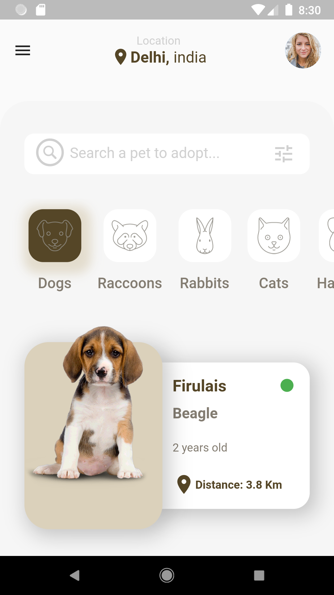

<h1><b>Taller de Flutter Diseño</b></h1>

Esta práctica fue realizada en vivo a traves de un taller que se dicto en vivo en el canal de discord [Locos por Flutter y Dart](https://discord.gg/KkY42c7AGV), el fin de este taller es ayudar a las personas nuevas en **Flutter** a conocer de una forma mas amigable como poder realizar **Front-End**  de forma correcta y bien estructurada.

Resultado final.

